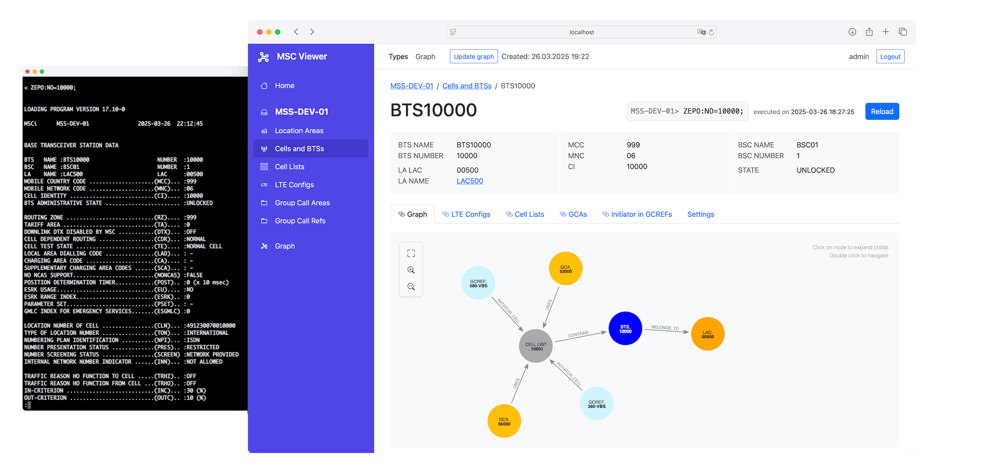
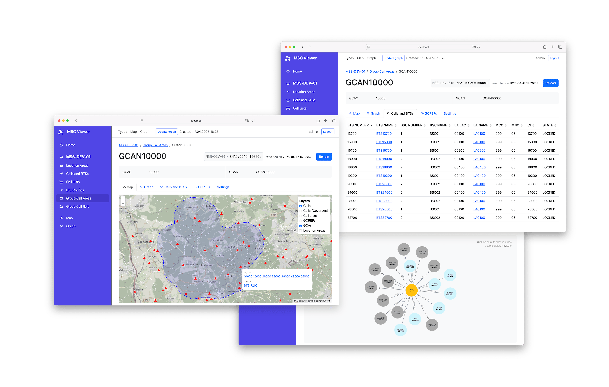

MscViewer for Nokia MSC/MSS
===
A user-friendly, web-based interface for MSC/MSS that helps users easily access, visualize and manage relevant configurations.



Since Nokia MSS/MSCs vary in versions and configurations, a one-size-fits-all UI is not practical. MscViewer is a toolkit for creating efficient and high-quality web applications for MSC/MSS, tailored to customer requirements.

MscViewer connects to the MSC via terminal, replacing manual command input with a user-friendly web interface that offers high-level functions like configuration linking, object graph and map visualizations.



The tool helps visualize configurations on a map to provide location context. Providing location information, such as coordinates or shapes, for the base objects allows the tool to calculate geographical representations of related configurations. For example, with latitude and longitude coordinates for cells and their coverage data, MscViewer can calculate shapes for location areas, GCREFs, and GCAs and put them on the map.


## Features

* Visualization of configuration hierarchy and relationships.
* Quick browsing and detail view of configurations.
* Export to CSV/Excel.
* Customizable for specific requirements, such as GSM-R.
* Manage multiple MSC instances through a unified interface.

## Try using Docker Compose

Run the application with sample data (without an MSC/MSS):

```sh
# build and run the entire stack
docker compose up --build

# open the web app
open http://localhost:9999/msc-viewer

# username/password: admin/admin1a!
```
 
## Getting Started

To compile and run the application:

```sh

# start neo4j 
docker compose up -d  msc-neo4j

# run the backend subproject
cd backend
./mvnw spring-boot:run -Dspring-boot.run.profiles=simple


# run the frontend subproject
cd frontend
npm install
npm start

# open the web app
open http://localhost:3000/msc-viewer

# username/password: admin/admin1a!
```

### Customizing the application
With MSC Viewer, you can declaratively define the MSC configurations you want to manage and their relationships. The GUI and dependency graph are then generated based on these configurations. Below is an example configuration for BTS configurations (Command `ZEPO`) : 

```java
	public ConfigType cells() {
		return new ConfigTypeBuilder()
				.listCommand("ZEPO::IDE") // MSC command to load the list of cells
				.detailCommand("ZEPO:NO=${NO}") // MSC command to load the cell with the given number
				.parser(new ConfigTypeParserBuilder() // Parser for the list of cells
						.listSeparator("BASE TRANSCEIVER STATION") // Separator for the list of cells
						.build()) //
				.defaultId("NO=BTS|NUMBER") //
				.frontend(f -> f //
						.title("Cells and BTSs") // list page title
						.column("BTS|NUMBER") // table columns
						.column("BTS|NAME", col -> col.linkToDetail()) //

						.detail(d -> d //
								.title("${NAME}", "NAME=BTS|NAME") // detail page title template
								.props("BTS|NAME", "BTS|NUMBER")// properties to display
								.propSeparator()//
								.prop("LA|LAC")//
							

						))
				.build();

	}
```


### Connect to MSC Instances

To connect to MSC instances, configure the necessary connection details such as the host, port and user credentials in the `backend/src/main/resources/application.yml`. Below is an example configuration for two MSC instances:

```yaml
instances:
  - id: MSS-INTG-01
    host: host-intg
    port: 22
    user: user
    password: pwd
  - id: MSS-PROD-01
    host: host-prod
    port: 22
    user: user
    password: pwd
```


## License
This project is licensed under the MIT License. See [LICENSE](LICENSE) for details.

## Open Source & Commercial Support  

MscViewer is 100% open-source (MIT License) and free to use. For organizations that need additional security, scalability, or expert assistance, we offer professional services and enterprise support:  

✔ Priority Support: SLA-backed response times  
✔ Custom Development: Tailored integrations and enhancements  
✔ Consulting: Architecture reviews, performance tuning  
✔ Long-Term Maintenance: Security patches, version upgrades  

[**Contact Our Team**](mailto:info@greenstones.de)  


## Contributing
Contributions are welcome! Open an issue or submit a pull request to suggest changes.